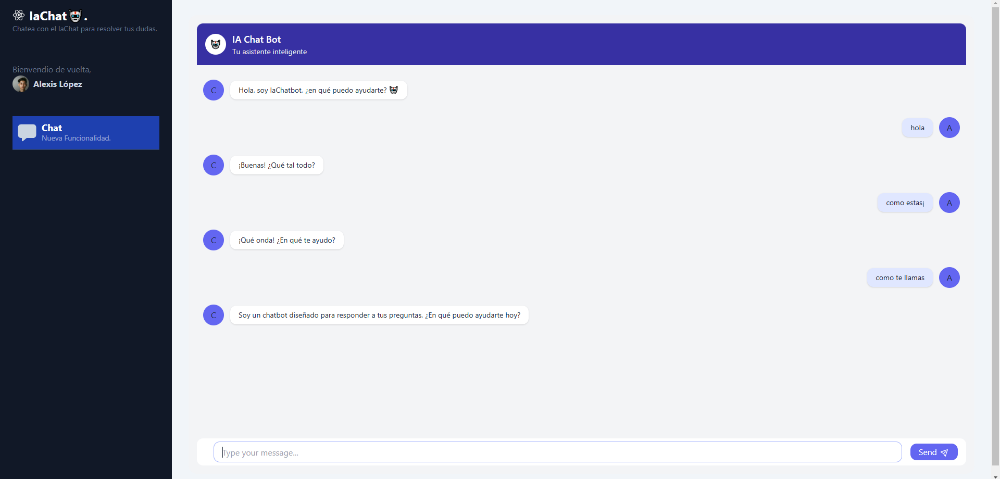

# Manual de Usuario

## Introducción

Este manual de usuario describe el funcionamiento y uso de un chatbot basado en inteligencia artificial, desarrollado como parte de un proyecto académico. La aplicación combina tecnologías modernas de procesamiento de lenguaje natural y desarrollo web para ofrecer una interacción dinámica y eficiente con los usuarios.

El chatbot utiliza un enfoque complementario: un modelo basado en embeddings con Universal Sentence Encoder (USE), diseñado para identificar intenciones predefinidas de manera rápida y precisa. 

La aplicación está desarrollada con React y Vite, proporcionando un entorno moderno, rápido y accesible. Este manual está orientado a guiar al usuario final en la interacción con el chatbot, desde su uso básico hasta la interpretación de las respuestas proporcionadas. Además, se explican las características principales de la interfaz y se incluyen recomendaciones para optimizar la experiencia de uso.

## Requisitos del Sistema

> **Systema Operativo:** Windows, Ubuntu 22.04 o superior, arch linux
> **CPU:** Intel Pentium D o AMD Athlon 64 (K8) 2.6GHz o superior

## Explicación de la aplicación

El usuario al ingresar a la página puede interactuar con el Chatbox

