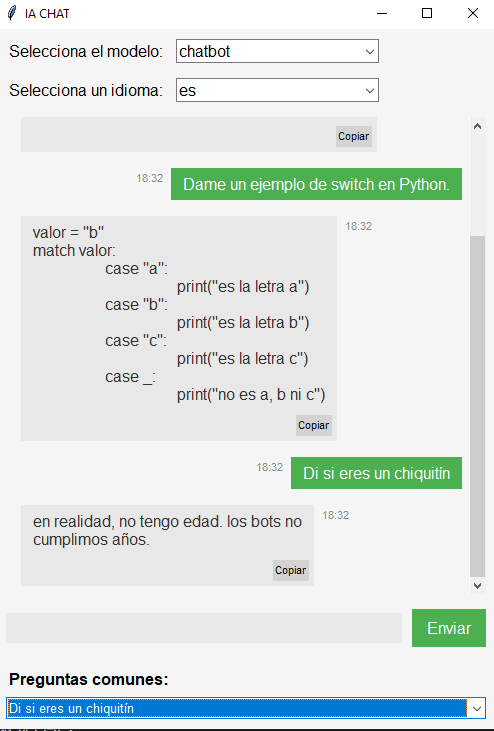
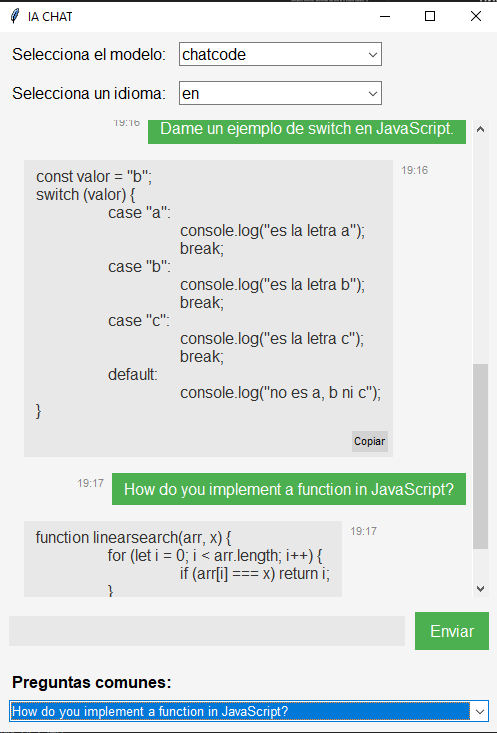

# Manual de Usuario

## Introducción

Este manual de usuario describe el funcionamiento y uso de un chatbot basado en inteligencia artificial, desarrollado como parte de un proyecto académico. La aplicación combina tecnologías modernas de procesamiento de lenguaje natural y desarrollo de interfaces gráficas para ofrecer una interacción dinámica y eficiente con los usuarios.

El chatbot utiliza un enfoque complementario: un modelo basado en embeddings con Universal Sentence Encoder (USE), diseñado para identificar intenciones predefinidas de manera rápida y precisa.

La aplicación está desarrollada utilizando Python y Tkinter para la interfaz visual, proporcionando un entorno robusto, accesible y fácil de usar. Este manual está orientado a guiar al usuario final en la interacción con el chatbot, desde su uso básico hasta la interpretación de las respuestas proporcionadas. Además, se explican las características principales de la interfaz y se incluyen recomendaciones para optimizar la experiencia de uso.

## Requisitos del Sistema

> **Systema Operativo:** Windows, Ubuntu 22.04 o superior, arch linux
> **CPU:** Intel Pentium D o AMD Athlon 64 (K8) 2.6GHz o superior

## Explicación de la aplicación
La aplicación de escritorio a parte de aceptar lo que es el idioma español e ingles para conversaciones imcluye lo que es codigo de algoritmos

-  **1:** Corresponde al lugar donde el usuario puede ingresar algún mensaje en español o inglés sin algún tipo de restricción.
-  **2:** Para ayudar al usuario se ha agregado la sección *"Preguntas comunes"*, una sección donde el usuario puede elegir entre distintas preguntas seleccionadas para el chatbot.
- **3:** Se le implemento la funcionalidad de dar algoritmos tanto en lenguaje de Python como en Javascript

-  **4:** El chatbot es capaz de hablar en inglés, por lo cuál esta sección permite cambiar el idioma de las *"Preguntas comunes"*, para preguntas tanto de código como llas normales, dependiendo del modelo que se seleccione y el lenguaje (para tener los listados de preguntas que se le pueden hacer).

- **5:** Con la intención de guiar al usuario el chatbot  indica de manera explícita posibles preguntas a realizar o temas que tratar.

## Ejemplificación del Funcionamiento
La aplicación en si para preguntas comunes o de código en cualquier idioma tiene lo que es la seleción de idioma para hacer las sugerencias del modelo seleccionado.

